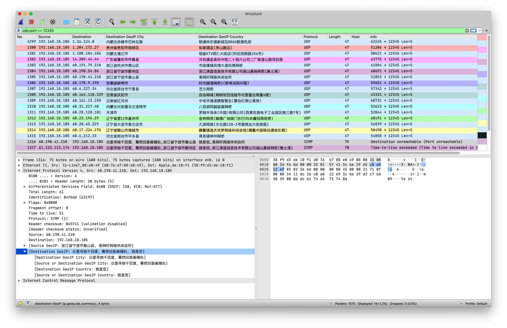
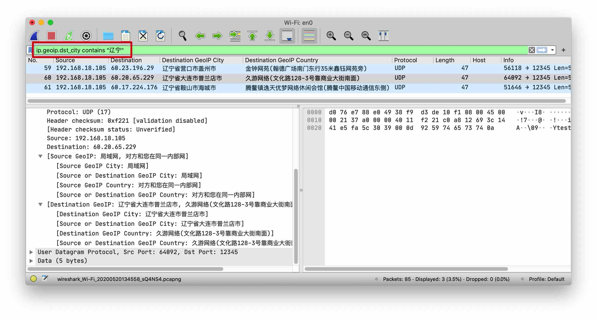
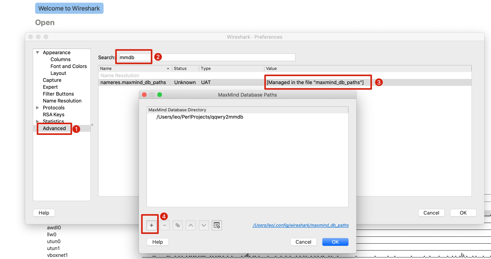
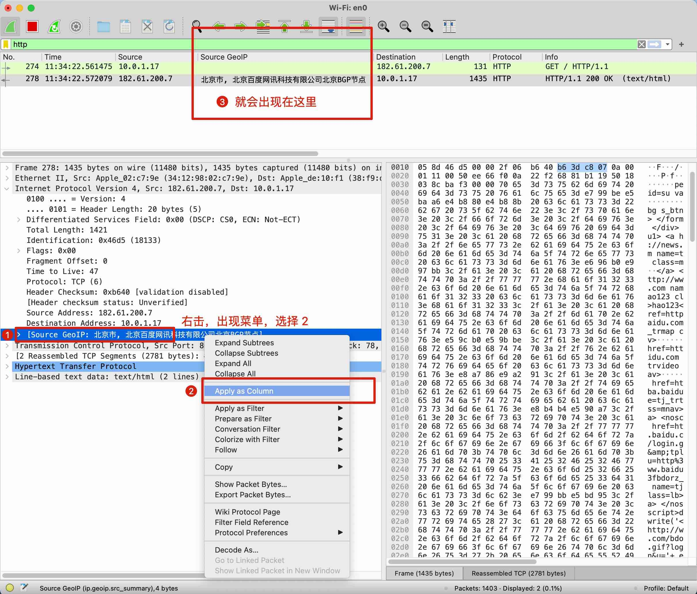

# qqwry2mmdb
 为抓包软件 Wireshark 能使用纯真网络 IP 数据库而提供的格式转换工具



## 特性

* 支持自定义 IP 数据库记录，例如向库中增加私网 IP 的归属信息。编辑 `qqwry2mmdb.pl`，打开 `remove_reserved_networks` 开关，新增自己的私人记录。

```perl
$tree->insert_range("192.168.1.1", "192.168.1.1", {
        city    => {
            names => {
                en => "众里寻她千百度，蓦然回首阑珊处"
            }
        },
        country => {
            names => {
                en => "就是您"
            }
        }
    });
```

* 支持根据 IP 属地的数据包过滤， 例如 `ip.geoip.dst_city contains "辽宁"`



## 描述

[Wireshark](https://www.wireshark.org/) 是网络抓包、协议分析、网络问题定位的"瑞士军刀"，功能非常强大，我本人非常喜欢的开源网络工具。在网络分析行为中 IP 地址归属地信息查询也是一个很重要的方面。在国内非常出名的，以及维护时间最久的IP归属地数据库应该非 [纯真网络IP数据库](http://www.cz88.net/ip/) 莫属了。至少对于我而言，我希望在 Wireshark 的程序界面里能同时看到捕获到的IP数据包的归属地信息，因此我研究了一下 Wireshark 的源代码，发现它本身已经基于 [libmaxminddb](https://github.com/maxmind/libmaxminddb) 库实现了这个功能（再次为它的强大点赞👍），只不过默认不携带具体的 IP 归属地数据库，需要自行安装。另外 [MaxMind DB](https://github.com/maxmind/MaxMind-DB/blob/master/MaxMind-DB-spec.md) 为开源格式的数据库，因此剩下的工作就简单了，只需要把纯真IP数据库的格式转换到 mmdb 格式，并配置 Wireshark 读取就大功告成了。


## 安装 qqwry.mmdb 数据库, 配置 Wireshark

配置 Wireshark 指定包含 qqwry.mmdb 的目录(⚠️此处是需要指明包含数据库文件的目录，不是数据库文件的绝对路径⚠️)



点击OK以后，重启 wireshark 抓包，你会发现在 “Packet List” 面版，看不到我上面截图中的那些中文IP信息，还需要进行下面的操作


## 安装 qqwry2mmdb.pl，自己生成特定数据库文件

MaxMind DB 自家的 [数据库生成工具](https://github.com/maxmind/MaxMind-DB-Writer-perl) 是基于 Perl 语言编写，因此本项目也是用 Perl 来实现(本想为了便携性用Go重写，但是看了看工作量又懒的再造轮子了)，使用并扩展了 [IP::QQWry](https://metacpan.org/pod/IP::QQWry) 库来读取纯真IP库的所有记录。

首先安装 [Perl](https://www.perl.org/get.html) ，然后安装 [cpanm](https://cpanmin.us/), 以及依赖库，`MaxMind::DB::Writer` 与 `IP::QQWry::Decoded`

### Linux (CentOS7)

```shell
yum -y install perl perl-CPAN
curl -L https://cpanmin.us | perl - App::cpanminus
cpanm --notest --force MaxMind::DB::Writer IP::QQWry::Decoded

#请自行下载最新版本的 qqwry.dat
perl qqwry2mmdb.pl /your/save/path/of/qqwry.dat
```

### macOS

```shell
brew install perl cpanm
cpanm --notest MaxMind::DB::Writer IP::QQWry::Decoded

#请自行下载最新版本的 qqwry.dat
perl qqwry2mmdb.pl /your/save/path/of/qqwry.dat
```

### windows

`MaxMind::DB::Writer` 不支持该平台
